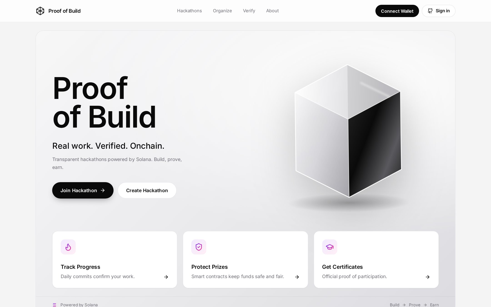

# Proof of Build

[](https://github.com/bakhtiyararzimetov/proof-of-build/actions/workflows/ci.yml)
[](LICENSE)
[](https://explorer.solana.com/address/8GYmgRJ9iRNE9kmBf5HkAfMu23Fdh6ES8XvXMbNdYvJw?cluster=devnet)
[](https://colosseum.org)

> Fair hackathons on Solana: prizes are locked in a smart contract, every day of real work becomes an on-chain "fire" from verified GitHub commits, and only people who actually built get paid.

[Live Demo](https://proofofbuild.vercel.app) · [Video Walkthrough](#) · [Docs](docs/) · [Colosseum Submission](#)

---



---

## Submission to 2026 Solana National Hackathon

| Name | Role | Contact |
|------|------|---------|
| Bakhtiyar Arzimetov | Founder & Full-stack Engineer | [GitHub](https://github.com/bakhtiyararzimetov) · [Telegram](https://t.me/Bakhtiyar124) |
| Raikhan | Product & Pitch | [GitHub](https://github.com/raiko-cyber) · [Telegram](https://t.me/Qayranbek0va) |
| Erkhan | Frontend Developer | [GitHub](#) · [Telegram](#) |

---

## Problem and Solution

### 1. Prizes are a promise, not a guarantee
- **Problem:** Organizers announce a prize pool, but nothing forces them to pay. Payouts are late, reduced, or never happen.
- **Proof of Build:** The organizer locks the USDC prize in a program-owned vault **before** the hackathon starts. The contract, not a person, pays out. If no winners are chosen within 7 days, the pool is split between everyone who did the work.

### 2. Nobody knows who actually built the project
- **Problem:** One person writes the code, four teammates share the prize. Projects are often built before the event and pushed at the last minute.
- **Proof of Build:** A GitHub App watches the team repository. Each day a participant pushes their own commit becomes a **fire** recorded on Solana. Only participants who reach the required number of fires share the prize or get their deposit back.

### 3. Cheating is invisible
- **Problem:** Old repositories, backdated commits, force-pushes, commits pushed on behalf of a teammate, throwaway GitHub accounts.
- **Proof of Build:** Eight automatic fraud flags (repository created before start, huge or bulk commits, date skew, force push, author mismatch, new account, inactive member). The organizer can disqualify on-chain with a reason hash; the deposit goes to the prize pool, never to the organizer.

### 4. Participation cannot be proven
- **Problem:** Certificates are PDFs anyone can edit.
- **Proof of Build:** Each certificate letter is hashed and the hash is written on-chain. Anyone can verify it at `/verify/<hash>`.

---

## Why Solana

- **Speed:** A fire is written within seconds of a `git push`, so the progress bar is live during the event.
- **Cost:** Recording a fire costs a fraction of a cent, so a daily on-chain record for every participant is affordable.
- **USDC and SPL tokens:** Prizes and deposits are real stablecoins held in a program vault. No custodial wallet is involved.
- **Anchor and PDAs:** Every hackathon, team, participant and fire is a deterministic account that anyone can audit from the explorer.
- **Wallets:** Phantom, Solflare and Backpack connect through the Wallet Standard with no extra integration.

---

## Summary of Features

- Organizer creates a hackathon and locks the USDC prize in a vault PDA
- Optional per-member deposit, refunded to everyone who reaches the goal
- Registration window: nobody can join a winning team at the last moment
- Teams with invite codes; the captain can rotate a leaked code
- GitHub App webhooks turn verified daily commits into on-chain fires
- Missed webhooks are re-requested from GitHub automatically every 15 minutes
- Eight fraud flags and on-chain disqualification with a reason hash
- Winners (1–3 teams, shares must sum to 100%) or automatic fair split
- Batched `finalize`, repeatable `claim`, `sweep` of unclaimed funds after 30 days
- Participation certificates by email, with the hash stored on-chain and publicly verifiable
- Installable as a mobile app (PWA) with an "Open in Phantom" flow on phones

---

## Tech Stack

| Layer | Technology |
|-------|-----------|
| On-chain program | Rust · Anchor 0.31 · SPL Token |
| Backend / Oracle | Node.js · Fastify 5 · Prisma 6 · PostgreSQL (Supabase) |
| GitHub integration | GitHub App (OAuth + push webhooks, HMAC-verified) |
| Frontend | React 18 · Vite · TypeScript · TailwindCSS 4 · Solana Wallet Adapter |
| Email | Resend (optional) |
| Testing | Bankrun (53 contract tests) · Vitest (41 backend tests) |

---

## Architecture

```
┌──────────────┐  push   ┌──────────────┐  webhook  ┌───────────────────────┐
│  Participant │───────▶ │    GitHub    │─────────▶ │   Backend (Oracle)    │
│   git push   │         │  (repo + App)│           │  ┌─────────────────┐  │
└──────┬───────┘         └──────────────┘           │  │ HMAC + fraud    │  │
       │ wallet                                     │  │ rules, 1 fire/  │  │
       ▼                                            │  │ day per person  │  │
┌──────────────┐  register / join / claim           │  └────────┬────────┘  │
│   Frontend   │──────────────────────┐             └───────────┼───────────┘
│ React + Vite │                      ▼                         │ record_fire
└──────────────┘            ┌──────────────────────────────────▼─┐
                            │  Solana program: proof_of_build    │
┌──────────────┐ create +   │  Hackathon · Vault · Team ·        │
│  Organizer   │──lock ───▶ │  Participant · Fire · Attestation  │
└──────────────┘  prize     └────────────────────────────────────┘
```

The money never passes through the backend. The oracle key can only record fires and attestations, while deposits, prizes and payouts are controlled by the program.

See [docs/architecture.md](docs/architecture.md) for the full breakdown.

---

## Quick Start

**Prerequisites:** Node.js 20+, Rust, Solana CLI 2.1, Anchor CLI 0.31, a PostgreSQL database, and a GitHub App.

```bash
# Clone the repository
git clone https://github.com/bakhtiyararzimetov/proof-of-build
cd proof-of-build

# Smart contract: build and run 53 tests
npm install
anchor build
npm test

# Backend
cd backend
npm install
cp .env.example .env          # fill in DATABASE_URL, GitHub App keys, oracle key
npx prisma migrate deploy
npm run dev                   # http://localhost:3000/health

# Frontend
cd ../frontend
npm install
cp .env.example .env
npm run dev                   # http://localhost:5173
```

Once everything is configured, one command starts the backend, the frontend and a public HTTPS tunnel (updates the GitHub webhook automatically):

```bash
npm run dev:public   # or: npm run dev  (localhost only)
```

The program is already deployed on devnet: [`8GYmgRJ9iRNE9kmBf5HkAfMu23Fdh6ES8XvXMbNdYvJw`](https://explorer.solana.com/address/8GYmgRJ9iRNE9kmBf5HkAfMu23Fdh6ES8XvXMbNdYvJw?cluster=devnet).

For the full setup (GitHub App fields, devnet test USDC, tunnels, deployment, common errors), see [docs/setup.ru.md](docs/setup.ru.md).

---

## Roadmap

- [x] Anchor program: prize vault, deposits, teams, fires, winners, claim, sweep
- [x] GitHub App oracle with fraud flags and webhook redelivery
- [x] Web app: organizer, team dashboard, admin panel, certificates
- [x] Devnet deployment
- [ ] Public deployment (Vercel + Render/Railway)
- [ ] Security audit and mainnet launch
- [ ] Multiple oracles / threshold signing
- [ ] Judge voting on-chain

Full roadmap: [docs/roadmap.md](docs/roadmap.md)

---

## Resources

- [Project Presentation](#)
- [Video Demo](#)
- [Live Application](https://proofofbuild.vercel.app)
- [Program on Solana Explorer](https://explorer.solana.com/address/8GYmgRJ9iRNE9kmBf5HkAfMu23Fdh6ES8XvXMbNdYvJw?cluster=devnet)
- [API Reference](docs/api.md)

---

## License

MIT, see [LICENSE](LICENSE)
